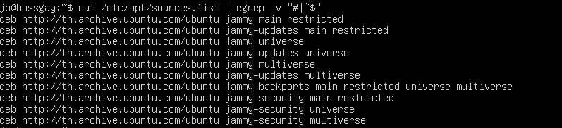

# Advanced Packaging Tool (APT)
## **Overview**
**Advanced Package Tool (APT)** เป็นอินเตอร์เฟซซอฟต์แวร์ฟรีที่ใช้กับ Debian และ Linux distributions  ที่มีพื้นฐานมาจาก Debian APT 
ทำให้กระบวนการการจัดการซอฟต์แวร์บนระบบคอมพิวเตอร์แบบ Unix-like กลายเป็นเรื่องง่ายขึ้นด้วยการทำงานโดยอัตโนมัติในการดึงข้อมูล กำหนดค่า 
และติดตั้งซอฟต์แวร์จากแพ็คเกจที่พร้อมคอมไพล์

มีเครื่องมือคำสั่งที่ใช้ใน การค้นหา การจัดการ และข้อมูลเกี่ยวกับแพคเกจ รวมถึงการเข้าถึง low-level ทุกฟีเจอร์ที่ libapt-pkg และ libapt-inst ให้ 
ซึ่งเป็นไลบรารีที่ higher-level ขึ้นมาจากพวกตัวจัดการแพคเกจ 

APT สามารถจัดการกับไฟล์ที่คอมไพล์ไว้ล่วงหน้าและการคอมไพล์รหัสต้นฉบับได้ ทำให้เป็นเครื่องมือที่มีประสิทธิภาพและ
สะดวกสบายสำหรับผู้ใช้ในการจัดการการติดตั้งและถอนการติดตั้งซอฟต์แวร์

## การใช้งาน
ชุดเครื่องมือที่ช่วยให้ผู้ใช้ติดตั้ง อัพเดทและจัดการซอฟต์แวร์บนระบบปฏิบัติการ Linux

**ลักษณะเด่น**

* เป็นชุดคำสั่งที่ใช้งานง่ายกว่าเครื่องมือจัดการแพ็คเกจดั้งเดิมอย่าง dpkg
* สามารถจัดการความสัมพันธ์ระหว่างแพ็คเกจต่างๆ ได้
* มีระบบติดตามการอัพเดทและเวอร์ชั่น
* เรียกใช้ dpkg ด้วยการเรียงลำดับแพ็คเกจอย่างเหมาะสมเพื่อให้การติดตั้งหรือลบ
* ในบางกรณีอาจใช้ตัวเลือก --force ของ dpkg เพื่อบังคับการดำเนินการ

## References
* APT - Debian Wiki: https://wiki.debian.org/Apt
* APT - Wiki: https://en.wikipedia.org/wiki/APT_(software)

## apt (Advance Packging Tools)
การที่ apt install, remove,.. etc  package ต่างๆ ของ **apt** จะเป็นการ download package มาจาก repository ที่มีอยู่แล้ว

---
## Check all Repository that have
`sudo cat /etc/apt/sources.list | egrep -v "#|^$"`

เป็นการแสดง repository ที่ทำการดึง package ทำให้สามารถ install package โดย apt ทั้งหมด

โครงสร้างของ sources.list ( ที่เก็บ repository ต่างๆ )

`<package version> <mirror site url> <release code> <repository component, component, component..........>`

## apt update
`sudo apt update`

**อัพเดต** list แพ็คเกจที่ติดตั้งบนระบบ

---
## apt upgrade
`sudo apt upgrade`

**อัพเกรด** แพ็คเกจที่โหลดไว้เป็น version ล่าสุด

`sudo apt upgrade package_name`

สามารถ อัพเกรด แค่แพ็คเกจที่ต้องการ

`sudo apt full-upgrade`

ข้อแตกต่างระหว่าง upgrade full-upgrade คือ แพ็คเกจที่ติดตั้งในภายหลังจะถูกลบออก หากจำเป็นในการอัพเกรดทั้งระบบ

!! Be very careful when using this command. !!

---

## apt install

`sudo apt install package_name`

ติดตั้งแพ็คเกจที่ต้องการ

`sudo apt install package_name1 package_name2`

สามารถติดตั้งแพ็คเกจหลายๆ อันพร้อมกันได้โดยการขั้นด้วย **space**

`sudo apt install /full/path/file.deb`

ถ้าต้องการติดตั้งไฟล์ `.deb` ให้ระบุเส้นทางแบบเต็มไปยังไฟล์

---

## apt remove

`sudo apt remove package_name`

ลบเเพ็คเกจที่ต้องการ

`sudo apt remove package_name1 package_name2`

สามารถลบแพ็คเกจหลายๆ อันพร้อมกันได้โดยการขั้นด้วย **space**

---

## apt purge

`sudo apt purge package_name`

คำสั้ง remove จะยังมีไฟล์กำหนดค่าที่ลบไม่หมด แต่ คำสั่ง purge เป็นคำสั่งที่ลบทุกไฟล์ที่อยู่ในแพ็คเกจ

---

## apt autoremove

`sudo apt autoremove`

เมื่อติดตั้งเเพ็คเกจที่มี dependency กับอีกแพ็คเกจ ถึงจะลบเพ็คเกจความเป็น dependency ยังอยู่มรระบบ

ใช้เอาไว้ลบ dependency ที่ไม่ต้องการ

---

## apt list

`sudo apt list`

คำสั่งที่ใช้แสดงรายการแพ็คเกจที่มีอยู่ทั้งหมด

`sudo apt list | package_name`

คำสั่งที่แสดง version, architecture ของแพ็คเกจที่ต้องการ

`sudo apt list --installed`

คำสั่งที่แสดงแค่แพ็คเก็จที่ติดตั้งอยู่

`sudo apt list --upgradeable`

คำสั่งที่แสดงแพ็คเกจที่สามารถอัพเกรดได้

---

## apt search

`sudo apt search package_name`

คำสั่งที่หา และแสดงแพ็คเกจที่สามารถใช้ได้

---

## apt show

`sudo apt show package_name`

คำสั่งที่แสดงรายละเอียดของแพ็คเกจ

---

## man apt

`man apt`

สามารถเรียนรู้คำสั่งอื่นๆ ที่ไม่ได้สอนในด้านบนได้

---

## recommand package
!! Internet required !!

พา install แพ็คเกจที่ทาสเเมวชอบแน่นอน!!!

`sudo apt update`

`sudo apt upgrade`

`sudo apt show nyancat`

ดูข้อมูลของแพ็คเกจ nyancat

`nyancat`

เช็คว่าเคยติดตั้งแพ็คเกจ nyancat หรือไม่

`ถ้าเคยติดตั้งแล้วขอแสดงความเสียใจให้กับคุณ`

`sudo apt install nyancat`

ติดตั้ง nyancat

`nyancat`

run nyancat

## Reference
- [https://jjeongil.tistory.com/1672](https://jjeongil.tistory.com/1672)

- [https://tttap.tistory.com/130](https://tttap.tistory.com/130)

